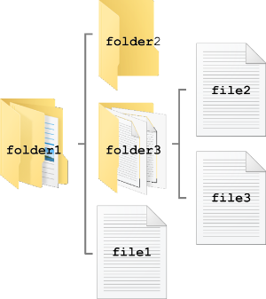

# [atet](https://github.com/atet) / [learn](https://github.com/atet/learn/blob/master/README.md#atet--learn) / [**_regex_**](https://github.com/atet/learn/blob/master/regex/README.md#atet--learn--regex)

[](#nolink)

# Introduction to Regular Expressions

**Estimated time to completion: 15 minutes**

* This introduction to regular expressions (regex) covers what's absolutely necessary to get you up and running
* You are here because **you want to learn some simple tricks to quickly process huge amounts of data**
* We will be using Bash command line interface (CLI) to perform basic operations; advanced material is not covered here

--------------------------------------------------------------------------------------------------

## Table of Contents

### Introduction

* [0. Requirements](#0-requirements)
* [1. Installation](#1-installation)
* [2. Preface](#2-preface)
* [3. Basic Use](#3-basic-use)
* [4. Example Files](#4-example-files)
* [5. Your First `grep`](#5-your-first-grep)
* [6. Extended `grep`](#6-extended-grep)
* [7. Tabular Data](#7-tabular-data)
* [8. Bigger Data](#8-bigger-data)
* [9. Experiment](#9-experiment)
* [10. Next Steps](#10-next-steps)

### Supplemental

* [Other Resources](#other-resources)
* [Troubleshooting](#troubleshooting)
* [Acknowledgments](#acknowledgments)

--------------------------------------------------------------------------------------------------

## 0. Requirements

* This tutorial was developed on Microsoft Windows 10 with Windows Subsystem for Linux (WSL) using Ubuntu 18.04 LTS
* If you are using MacOS, [your Terminal program is Bash](https://en.wikipedia.org/wiki/Terminal_(macOS))
* Most Linux distributions use or can use Bash

[Back to Top](#table-of-contents)

--------------------------------------------------------------------------------------------------

## 1. Installation

### Windows 10

* Windows Subsystem for Linux (WSL) is a fully supported Microsoft product for Windows 10, learn how to install it here: [https://docs.microsoft.com/en-us/windows/wsl/install-win10](https://docs.microsoft.com/en-us/windows/wsl/install-win10)
* Please choose Ubuntu 18.04 LTS as the distribution you use with WSL
* WSL is only available for Windows 10

### MacOS

* You do not need to install anything, [your Terminal program is Bash](https://en.wikipedia.org/wiki/Terminal_(macOS))

### Linux

* I recommend using Ubuntu 18.04 LTS

[Back to Top](#table-of-contents)

--------------------------------------------------------------------------------------------------

## 2. Preface

### What is Bash?

* Bash is a command line interface (CLI) that allows you to use your operating system purely by text commands 
   * This is a huge benefit over clicking buttons in a graphical user interface **especially if you have a ton of repetitive and routine tasks**
* If you're a Windows user like I am, _unlike DOS Command Prompt that is tied to Microsoft_, Windows Subsystem for Linux finally allows some cross-compatibility with Linux and MacOS

### WARNING: CLI is very powerful

* With great power comes great responsibility; be vigilant of code you run so accidents don't happen
* If this is your first experience with using a command line interface, don't be intimidated, this is worth learning

### Regular Expressions

* Basically, regular expressions are special notation that describes a pattern
* This notation can be:
   * As simple as "`.`" (regex wildcard), in which you can use "`.\.pdf`" to search for all PDF filenames on your computer
   * Or a bit more complex like "`[A-z0-9]+@[A-z0-9]+\.[A-z]+`" to search for all valid email addresses in a huge mailing list

[Back to Top](#table-of-contents)

--------------------------------------------------------------------------------------------------

## 3. Basic Use

### File Structure

* If you're accustomed to using a graphical user interface (GUI) file explorer, just continue to think of your files and folders (a.k.a. "directories") in a tree-like structure

[](#nolink)

* Now let's just think of the files by file name only

```
          |- folder2   |- file2
folder1 --|- folder3 --|
          |- file1     |- file3
```

* Let's represent each `file1-3` by their file path starting from the left to the right
* The first "`/`" denotes the "root" of the file structure

```
/folder1/file1
/folder1/folder3/file2
/folder1/folder3/file3
```


### Welcome to CLI

* Before we dive into regular expressions, let's go over some basic commands to get around in Bash
* When you first start your command line interface (CLI), you'll typically be greeted with something similar to this:

```
atet:LAPTOP:~$ _
```

* **IMPORTANT: For the sake of this tutorial, type out any commands you see after the `$` in the examples below**

```
atet:LAPTOP:~$ echo hello
hello
```

* The results will also be shown for reference

### Navigation

* If you execute the command `pwd` ("print working directory"), you'll see where you are currently in your file system

```
atet@LAPTOP:~$ pwd
/home/atet
```

* We can see what files are in your current working directory by executing `ls` ("list")

```
atet@LAPTOP:~$ ls
book.txt  new  song.mp3
```

* If you need more information about your files, you can add the flag `-l` to see more detail

```
atet@LAPTOP:~$ ls -l
total 0
-rw-rw-rw- 1 mba mba    0 Dec 21 18:39 book.txt
drwxrwxrwx 1 mba mba 4096 Dec 21 18:42 new
-rw-rw-rw- 1 mba mba    0 Dec 21 18:39 song.mp3
```

* A lot of information, but in this example we see that the file `new` is actually a directory (look all the way to the left and you see the `d`)
* If you have directories you want to navigate in and out of, you can use `cd <DIRECTORY NAME>` ("change directory") to go in and `cd ..` to go out

```
atet@LAPTOP:~$ cd new
atet@LAPTOP:~/new$ cd ..
atet@LAPTOP:~$
```

### File Management

* We only need to know four commands for file management this tutorial
* To make a new directory, use `mkdir <NEW NAME>` ("make directory")

```
atet@LAPTOP:~$ mkdir folder
atet@LAPTOP:~$ cd folder
atet@LAPTOP:~/folder$
```

* We will download an example files from my GitHub to work on, let's download one now with the program `wget`

```
atet@LAPTOP:~/folder$ wget https://raw.githubusercontent.com/atet/learn/master/regex/data/jane.txt

<A BUNCH OF WGET STATUS TEXT>

atet@LAPTOP:~/folder$ ls
jane.txt
```

* This is a short file, so we can peek at **all** the text contents using the program `cat` (don't use `cat` on big files, use `head` or `tail`)

```
atet@LAPTOP:~/folder$ cat jane.txt
Andrew_WK_-_Party_Hard.mp4
Beethoven_-_Fur_Elise.m4a
Beethoven_-_Symphony_No_6.mp3
Eddie_Murphy_-_Party_All_the_Time.mp3
LMFAO_-_Party_Rock_Anthem.mp4
Miley_Cyrus_-_Party_In_The_USA.mp4
Rick_Astley_-_Never_Gonna_Give_You_Up.m4a
```

* Let's **permanently delete** this file for now with `rm` ("remove")
   * WARNING: There will be no confirmation to delete files nor is there a concept of "recycling bin" here, be very careful with `rm`

```
atet@LAPTOP:~/folder$ ls
jane.txt
atet@LAPTOP:~/folder$ rm jane.txt
atet@LAPTOP:~/folder$ ls
atet@LAPTOP:~/folder$ _
```

[Back to Top](#table-of-contents)

--------------------------------------------------------------------------------------------------

## 4. Example Files

* **I will now start each line with only `$`, type everything _after_ this**
* Let's start at your home directory (a.k.a. `~`) and make a new empty directory to work from

```
$ cd ~
$ mkdir regex
$ cd regex 
```

* Download these two example files from my GitHub using `wget` and chaining the two commands into one line using `&&`

```
$ wget https://raw.githubusercontent.com/atet/learn/master/regex/data/jane.txt && \
  wget https://raw.githubusercontent.com/atet/learn/master/regex/data/john.txt

<A BUNCH OF WGET STATUS TEXT>

$ ls
jane.txt  john.txt
```

* We can look at the text content of all the files in the current directory using `cat` and the wildcard `*` (this means **ALL** files)

```
$ cat *
Andrew_WK_-_Party_Hard.mp4
Beethoven_-_Fur_Elise.m4a
Beethoven_-_Symphony_No_6.mp3
Eddie_Murphy_-_Party_All_the_Time.mp3
LMFAO_-_Party_Rock_Anthem.mp4
Miley_Cyrus_-_Party_In_The_USA.mp4
Rick_Astley_-_Never_Gonna_Give_You_Up.m4a
Party All the Time - Eddie Murphy.m4a
MOZART PIANO SONATA 11.M4A
eddie - party all the time (remix).mp4
mozart_requiem.mp3
Rick Astley - Never Gonna Give You Up.m4a
ANDREW WK - PARTY HARD.MP4
```

[Back to Top](#table-of-contents)

--------------------------------------------------------------------------------------------------

## 5. Your First `grep`

* We need to find songs in John's music library which are of the `*.mp3` file type:

```
$ grep -n "mp3" john.txt
4:mozart_requiem.mp3
```

* It looks like line number 4 has the one file we were looking for (`-n` flag will output line number, try without it)

* We need to find songs in John's library that are NOT `*.m4a` audio (`-v` flag, you can stack different flags together):

```
$ grep -vn "m4a" john.txt
2:MOZART PIANO SONATA 11.M4A
3:eddie - party all the time (remix).mp4
4:mozart_requiem.mp3
6:ANDREW WK - PARTY HARD.MP4
```

* Almost, line 2 is an *.m4a file and was included, let's ignore case (`-i`):

```
$ grep -vni "m4a" john.txt
3:eddie - party all the time (remix).mp4
4:mozart_requiem.mp3
6:ANDREW WK - PARTY HARD.MP4
```

* Let's see all the songs that have "party" in the title in John's library AND (remember `&&`) also count them (`-c`):

```
$ grep -ni "party" john.txt && grep -ci "party" john.txt
1:Party All the Time - Eddie Murphy.m4a
3:eddie - party all the time (remix).mp4
6:ANDREW WK - PARTY HARD.MP4
3
```

* Three party songs! Now let's include Jane's library in this search
* Currently, your working directory only has the `john.txt` and `jane.txt` file, so if we use the wildcard `*` instead of a file name, all files in the current directory will be searched together
* Additionally, we just want to output which file (not all the file contents) contains songs by Beethoven (`-l"`)

```
$ grep -li "beethoven" *
jane.txt
```

* Looks like only Jane has songs from Beethoven, how about Mozart

```
$ grep -li "mozart" *
john.txt
```

* Looks like only John has songs from Mozart, how about "party" songs

```
$ grep -li "party" *
jane.txt
john.txt
```

* Looks like they both like to party, let's see all the party songs between the two of them:

```
$ grep -ni "party" *
jane.txt:1:Andrew_WK_-_Party_Hard.mp4
jane.txt:4:Eddie_Murphy_-_Party_All_the_Time.mp3
jane.txt:5:LMFAO_-_Party_Rock_Anthem.mp4
jane.txt:6:Miley_Cyrus_-_Party_In_The_USA.mp4
john.txt:1:Party All the Time - Eddie Murphy.m4a
john.txt:3:eddie - party all the time (remix).mp4
john.txt:6:ANDREW WK - PARTY HARD.MP4
```

* That's a lot of party songs, but what if we only want remixes of party songs? This will require us to perform two `grep` operations:
   1. The first operation will look for all songs with "party" and pass these results to...
   2. The second operation which will further look for songs with "remix"
* We can combine the two operations using the pipe operator "`|`" to pass information (this is different than `&&` earlier which just performed two separate commands)
   * Note that the second operation doesn't need the `-n` flag or `*` wildcard since it is getting "filtered" input directly from the first operation

```
$ grep -ni "party" * | grep "remix"
john.txt:3:eddie - party all the time (remix).mp4
```

* Like the great Eddie Murphy always says:

> _"Party all the time"_ -Eddie Murphy

[Back to Top](#table-of-contents)

--------------------------------------------------------------------------------------------------

## 6. Extended `grep`

### **TLDR**: Just use `grep -E` or `egrep`

* In order to use more advanced `grep` functionality, **you must use the `-E` flag**
   * I recommend always using this flag with any `grep` command or use `egrep` ("extended `grep`")
   * Using extended `grep` will not require you to use [escape characters](https://en.wikipedia.org/wiki/Escape_character#Bourne_shell) for some symbols
   * `egrep` has all the same functionality as `grep`

### Back to the show

* Let's search for songs by both mozart OR beethoven using an extended `grep` command "`|`"
   * "`|`" used in `grep` context between the quotations means "or", not pipe as above in Bash context
   * You must use the `-E` flag for use of pattern matching commands like "`|`", try without `-E` and it won't work

```
$ grep -En "mozart|beethoven" *
john.txt:4:mozart_requiem.mp3
```

* I know there were more songs.. oops, don't forget to ignore case

```
$ grep -Eni "mozart|beethoven" *
jane.txt:2:Beethoven_-_Fur_Elise.m4a
jane.txt:3:Beethoven_-_Symphony_No_6.mp3
john.txt:2:MOZART PIANO SONATA 11.M4A
john.txt:4:mozart_requiem.mp3
```

* Let's see which of these classical songs have numbers in the title
* `[0-9]` means to look for numerals 0 through 9 and the `+` "quantifier" after means one or more of the thing before
* Let's also combine this with the Bash pipe operator `|` (remember, different "meaning" than regex "or")

```
$ grep -Eni "mozart|beethoven" * | grep -E "[0-9]+"
jane.txt:2:Beethoven_-_Fur_Elise.m4a
jane.txt:3:Beethoven_-_Symphony_No_6.mp3
john.txt:2:MOZART PIANO SONATA 11.M4A
john.txt:4:mozart_requiem.mp3
```

* Oh no, looks like some file extensions with numbers were picked up here too
* Let's make this more specific by adding the regex wildcard `.` and quantifier `+`
* This means that the numbers we are looking for can't be at the end of the filename (i.e. file extension) since there must be some characters after

```
$ grep -Ei "mozart|beethoven" * | grep -E "[0-9]+.+"
jane.txt:Beethoven_-_Fur_Elise.m4a
jane.txt:Beethoven_-_Symphony_No_6.mp3
john.txt:MOZART PIANO SONATA 11.M4A
```

* Almost, looks like "mp3" was removed, but not "m4a", **let's be more specific to say that you need a space before the number**
   * NOTE: Spaces in the regex command are considered as literal spaces to be looked for in a pattern

```
$ grep -Ei "mozart|beethoven" * | grep -E " [0-9]+.+"
john.txt:MOZART PIANO SONATA 11.M4A
```

* Could've sworn there were two files, Oh! the other file had an underscore, not a space before the number 6, let's try a regex or "`|`"

```
$ grep -Ei "mozart|beethoven" * | grep -E " [0-9]+.+|_[0-9]+.+"
jane.txt:Beethoven_-_Symphony_No_6.mp3
john.txt:MOZART PIANO SONATA 11.M4A
```

* We've seen so far that the results were just printed out to the screen, let's write that output into a new file called `results.txt` using redirection "`>`"

```
$ grep -Ei "mozart|beethoven" * | grep -E " [0-9]+.+|_[0-9]+.+" > results.txt
$ cat results.txt
jane.txt:Beethoven_-_Symphony_No_6.mp3
john.txt:MOZART PIANO SONATA 11.M4A
```

* Cool, now let's clear out all the files to work on different data in the next section:

```
$ rm john.txt && rm jane.txt && rm results.txt
```

[Back to Top](#table-of-contents)

--------------------------------------------------------------------------------------------------

## 7. Tabular Data

* Looks like John and Jane updated their library data with additional information, let's download it:

```
$ wget https://raw.githubusercontent.com/atet/learn/master/regex/data/jane.csv && \
  wget https://raw.githubusercontent.com/atet/learn/master/regex/data/john.csv
```

* Let's look at the new data using `head -3` (show only the first three lines of each file):

```
$ head -3 *
==> jane.csv <==
owner,filename,genre,length,date modified
Jane,Andrew_WK_-_Party_Hard.mp4,Hard Rock,3:26,2016-10-24
Jane,Beethoven_-_Fur_Elise.m4a,Classical,2:56,2007-01-04
==> john.csv <==
owner,filename,genre,length,date modified
John,Party All the Time - Eddie Murphy.m4a,Funk,4:08,2008-11-20
John,MOZART PIANO SONATA 11.M4A,Classical,14:31,2007-03-07
```

* Looks like it's comma separated values (CSV), like something you'd see in a spreadsheet program like Excel
* Unfortunately, it's not very readable above, let's use the `column` command to make it a bit prettier (with some flags):

```
$ head -3 * | column -t -s,
==> jane.csv <==
owner             filename                               genre      length  date modified
Jane              Andrew_WK_-_Party_Hard.mp4             Hard Rock  3:26    2016-10-24
Jane              Beethoven_-_Fur_Elise.m4a              Classical  2:56    2007-01-04
==> john.csv <==
owner             filename                               genre      length  date modified
John              Party All the Time - Eddie Murphy.m4a  Funk       4:08    2008-11-20
John              MOZART PIANO SONATA 11.M4A             Classical  14:31   2007-03-07
```

* There's a lot more information here, but we only care about `owner`, `filename` and `genre`; let's cut those out to show by using the program `cut`
* We are going to use the flag `-d ","` to denote we are splitting the columns by a comma and `-f1,2,3` to only get columns 1-3 (and not columns 4 and 5)

```
$ head -3 * | cut -d "," -f1,2,3 | column -t -s,
==> jane.csv <==
owner             filename                               genre
Jane              Andrew_WK_-_Party_Hard.mp4             Hard Rock
Jane              Beethoven_-_Fur_Elise.m4a              Classical
==> john.csv <==
owner             filename                               genre
John              Party All the Time - Eddie Murphy.m4a  Funk
John              MOZART PIANO SONATA 11.M4A             Classical
```

* John's having a party and we really want to play a pop music video (MP4 file) in the background, let's see what we have:

```
$ cut -d "," -f1,2,3 * | column -t -s, | grep "Pop" | grep -iE ".+\.mp4"
Jane   Miley_Cyrus_-_Party_In_The_USA.mp4         Pop
```
* Looks like Jane has a classic jam for John to play
* Cool, now let's clear out all the files to work on different data in the next section:

```
$ rm john.csv && rm jane.csv
```

**You're thinking that those files were so small we could've just manually looked at them.. true, but how about the data in the next section?**

[Back to Top](#table-of-contents)

--------------------------------------------------------------------------------------------------

## 8. Bigger Data

* We will download a larger dataset of news articles as another example<sup>[[1]](#acknowledgments)</sup>.

```
$ wget https://raw.githubusercontent.com/atet/learn/master/regex/data/newsCorpora.zip
```

* This is a large file and has been compressed, let's extract the file:

```
$ unzip newsCorpora.zip
```

* This tab separated values (TSV) file contains 423,812 records of news articles and eight columns of information describing them
* We can double check how many lines of data a file has with `wc -l`

```
$ wc -l newsCorpora.tsv
423813 newsCorpora.tsv
```

* 423,812? I see 423,813, are we missing a line?
* Let's look at a small snapshot of the data with the program `head` and tidy up the display with `column` using the flag `-s $'\t'` to separate by tabs
   * Since this is a really big file, we wouldn't want to use commands like `cat` to output everything to the console
   * **If you accidentally `cat`, type `CTRL+C` to cancel the current execution**

```
$ head -2 newsCorpora.tsv | column -t -s $'\t'
ID  TITLE                                                                 URL                                                                                                                          PUBLISHER          CATEGORY  STORY                          HOSTNAME         TIMESTAMP
1   Fed official says weak data caused by weather, should not slow taper  http://www.latimes.com/business/money/la-fi-mo-federal-reserve-plosser-stimulus-economy-20140310,0,1312750.story\?track=rss  Los Angeles Times  b         ddUyU0VZz0BRneMioxUPQVP6sIxvM  www.latimes.com  1394470370698
```

* Ah, the top line is counted by `wc` but is the header row and isn't an actual record of data
* This file looks dense, and there's 423,811 more records!
* Let's cut down this data to only the `TITLE` (column 2),  `PUBLISHER` (column 4), and `HOSTNAME` (column 7) and check that the output is correct

```
$ cut -f2,4,7  -d$'\t' newsCorpora.tsv | \
  head -5 | column -t -s $'\t'
```

* Looks good so far, let's move these results into a new file called `newsCorpora2.tsv` and double check the contents

```
$ cut -f2,4,7  -d$'\t' newsCorpora.tsv > newsCorpora2.tsv && \
  head -5 newsCorpora2.tsv | column -t -s $'\t'
```

* I'm curious to see how many articles are from ".com" websites, since I tend to associate that with more legitimate websites
* Let's use the regex "anchor" `$` symbol to denote that the term `.\.com` needs to occur right at the end of the line

```
$ grep -Eic ".\.com$" newsCorpora2.tsv
348971
```

* Oh wow, so almost 75K articles not from a .com website, good to know!
* Now I'm really curious what news outlets don't have a .com website, let's take a sample of ten sites to manually check

```
$ cut -f7 -d$'\t' newsCorpora.tsv | \
  head -10 | grep -Eiv ".\.com$"
HOSTNAME
```

* Wait what? I just got `HOSTNAME`...**OOPS! I made a mistake**; can you figure it out?
* I only passed the ten-line `head` of the `cut` to `grep`, not the entire data, let's do that over in the right order

```
$ cut -f7 -d$'\t' newsCorpora.tsv | \
  grep -Eiv ".\.com$" | head -10
```

* There we go! I see a lot of websites from other countries, let's just make the decision to just include Canadian websites too (".ca") and make a new file called `newsCorpora3.tsv`

```
$ grep -Eic ".\.com$|.\.ca$" newsCorpora2.tsv
354454
$ grep -Ei ".\.com$|.\.ca$" newsCorpora2.tsv > newsCorpora3.tsv
```

* Let's see what articles are published by the Los Angeles Times about the stock market, we'll just look at the top 50

```
$ grep -Ein "Los Angeles Times" newsCorpora2.tsv | \
  grep -Ei "stock" | head -50 | column -t -s $'\t'
```

* Interesting, not even 50 articles from LA Times during this database's time period, oh well
* Done for now, let's clear out all the files:

```
$ rm newsCorpora.csv && rm newsCorpora.zip
```

[Back to Top](#table-of-contents)

--------------------------------------------------------------------------------------------------

## 9. Experiment

* Regex is one of those skills that you need occasionally, but if you've done a lot at one point, it's easier to pick back up when you need it
* I would suggest you try this tutorial a few times over to get used to the flow and experiment with new ways of slicing and dicing the data you might see online
* Just remember to be careful with some commands like `rm`!

[Back to Top](#table-of-contents)

--------------------------------------------------------------------------------------------------

## 10. Next Steps

**I'll leave you with a few review topics before suggesting your next step in data analysis with regex**

1. Regex can get very complex to match specific patterns, but you can break down any pattern into its components to make sense of it
2. We've seen that John was a bit lax with his naming conventions while Jane was tidier and more consistent: In the real world, be prepared to deal with more messy data than "perfect" data
3. When you have the opportunity to start recording your own data, use best practices to start off with organized and consistent formatting (naming conventions, date format, etc.)
4. _Remember all the fine tuning we had to do to get the right results?_ In big data, not being able to readily see everything with might cause us to miss a few things (false positives and false negatives), but sometimes **it's the best we can do; nothing will be perfect**

**I highly recommend learning how to use the powerful `sed` (stream editor) program, used in conjunction with `grep` to replace text after specific patterns are found: [Atet's 15 Minute Introduction to Stream Editor](https://github.com/atet/learn/blob/master/sed/README.md#atet--learn--sed)**

[Back to Top](#table-of-contents)

--------------------------------------------------------------------------------------------------

## Other Resources

Description | Link
--- | ---
`grep` Manual | https://www.gnu.org/software/grep/manual/grep.html
Basic vs. Extended `grep` | https://www.gnu.org/software/grep/manual/html_node/Basic-vs-Extended.html
Bash Reference Manual | https://www.gnu.org/software/bash/manual/bash.pdf
Regex Cheat Sheet | https://staff.washington.edu/weller/grep.html

[Back to Top](#table-of-contents)

--------------------------------------------------------------------------------------------------

## Troubleshooting

Issue | Solution
--- | ---
`$: command not found` | Don't type the `$` at the beginning of the example commands, that's there for line reference
There's no match result to my `grep` | Use `egrep` to see if you forgot to use an [escape character](https://en.wikipedia.org/wiki/Escape_character#Bourne_shell) or maybe you have a unintended space somewhere?
`unzip: command not found` | Install with `$ sudo apt-get install unzip` which requires `sudo` (administrator) permission

* Q: Why do the symbols have different meaning sometimes?
* A: The syntax in Bash and regex share some symbols, but have different meaning:

Symbol | Bash | Regex
--- | --- | ---
`*` (asterisk) | Wildcard | "Zero or more" quantifier
`.` (period) | Current directory | Wildcard
`\|` (pipe/bar) | Pipe operator | "Or" logical operator
`$` | Multiple functionality</br>depending on context | "End of line" anchor

[Back to Top](#table-of-contents)

--------------------------------------------------------------------------------------------------

## Acknowledgments

1. newsCorpora.tsv is modified from NewsAggregatorDataset.zip: <a href="http://archive.ics.uci.edu/ml/datasets/News+Aggregator" target="_blank">Dua, D. and Graff, C. (2019). UCI Machine Learning Repository [http://archive.ics.uci.edu/ml]. Irvine, CA: University of California, School of Information and Computer Science.</a>

[Back to Top](#table-of-contents)

--------------------------------------------------------------------------------------------------

<p align="center">Copyright © 2019-∞ Athit Kao, <a href="http://www.athitkao.com/tos.html" target="_blank">Terms and Conditions</a></p>